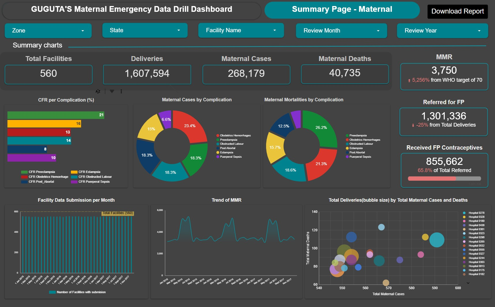
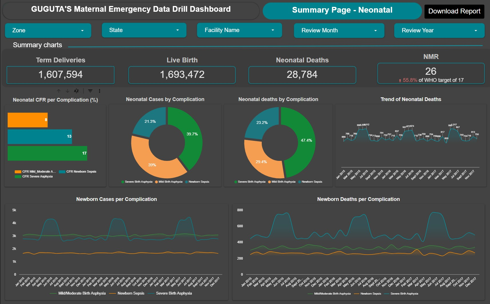
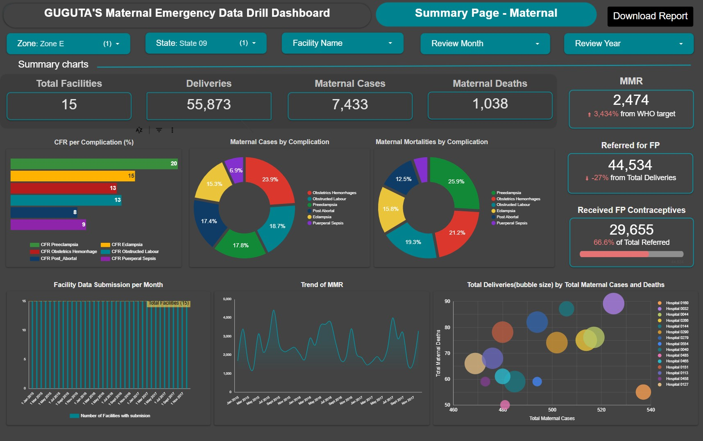
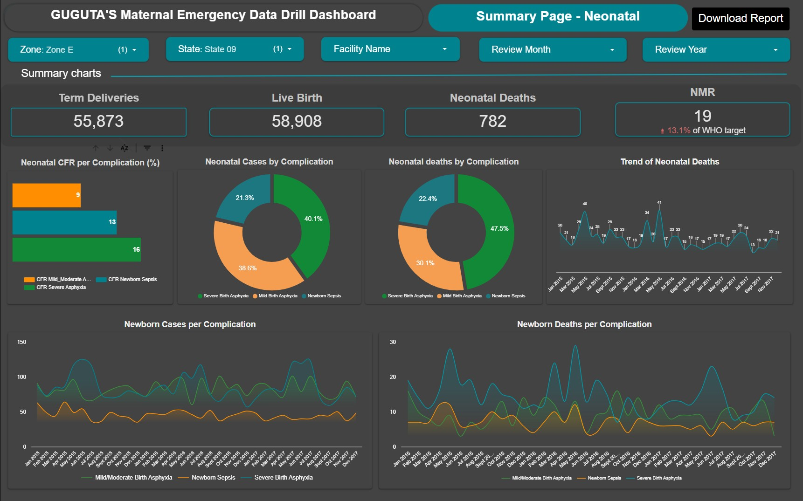
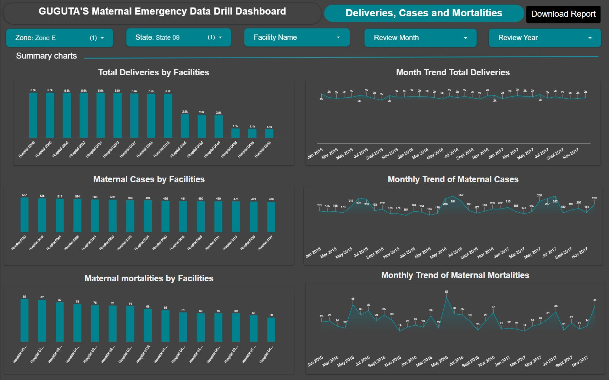
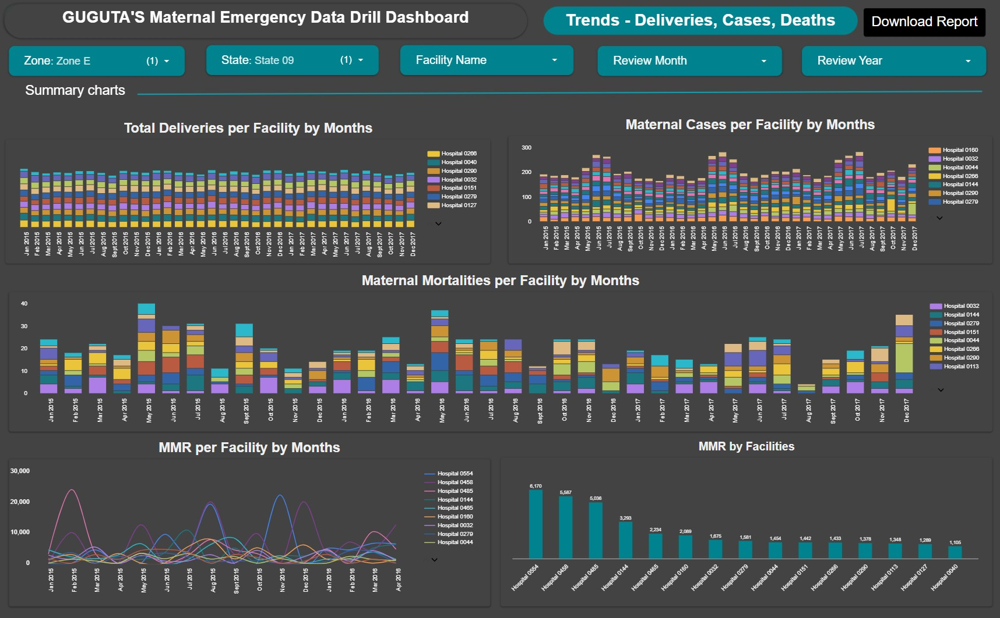
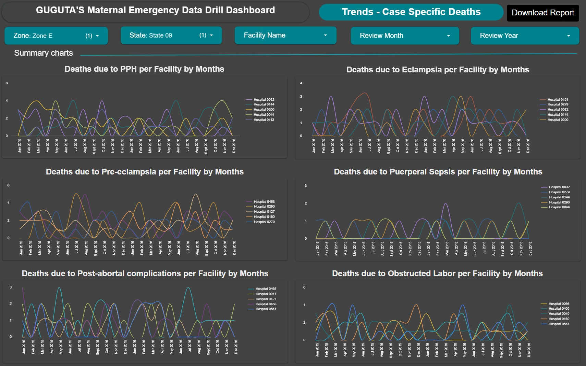
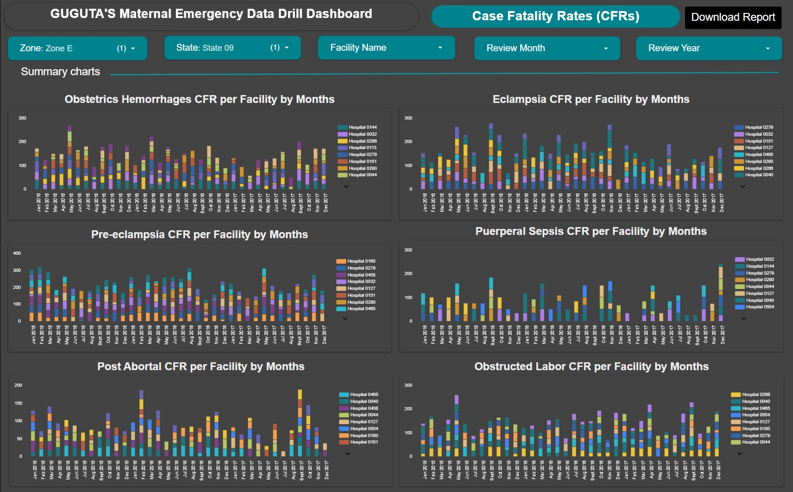
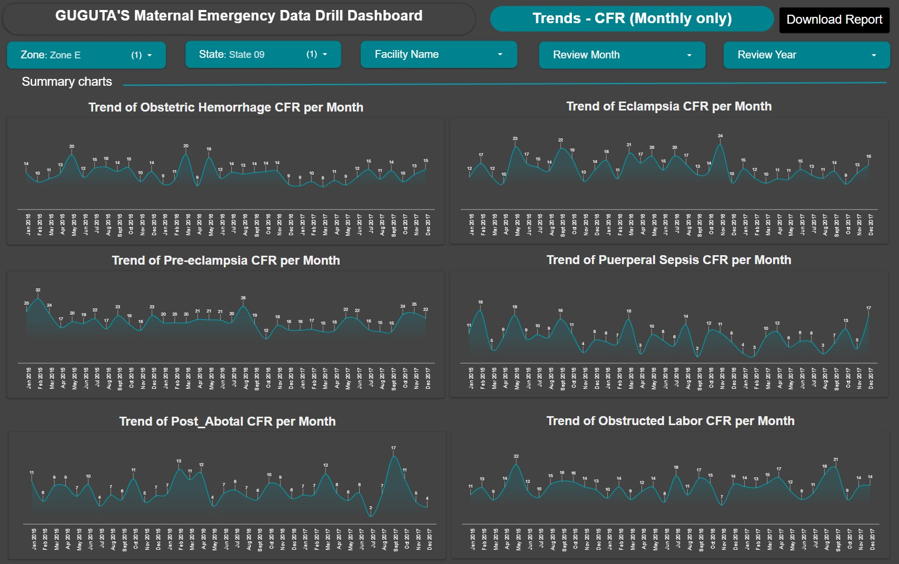
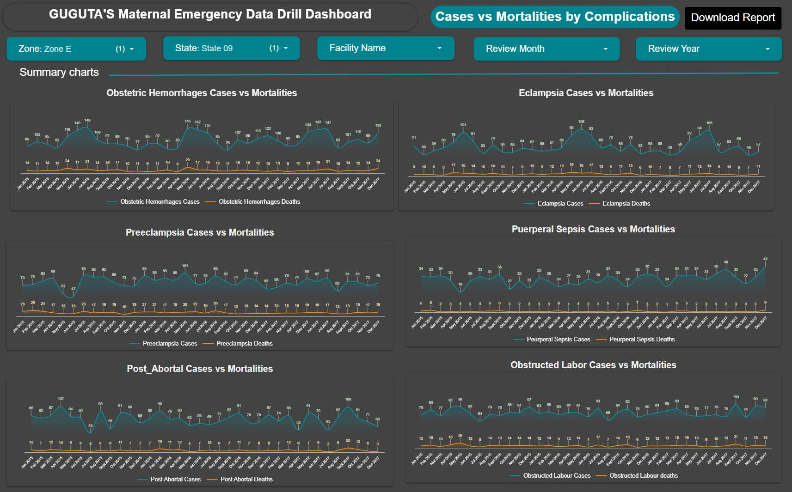

# GUGUTA's Maternal Emergency Data Drill Dashboard
**Multi-Level Interactive Public Health Surveillance Dashboard — Google Looker Studio**

> A fully interactive, multi-page public health analytics dashboard built in Google Looker Studio, using a synthetic dataset generated in Python and refined in Google Sheets to mirror real-world maternal and neonatal health trends in sub-Saharan Africa. The dashboard enables evidence-based decision-making across all administrative levels — from national leadership to facility-level clinical teams — by providing drill-down visibility into maternal mortality, case fatality rates, complication profiles, and delivery outcomes across a fictitious country called **Guguta**, comprising **9 geopolitical zones**, **45 states**, and **560 health facilities**.

🔗 **[View Live Dashboard](https://lookerstudio.google.com/s/sH1vy4j381I)**

---

## Table of Contents

1. [Project Overview](#1-project-overview)
2. [The Problem This Solves](#2-the-problem-this-solves)
3. [Dataset — Design, Generation & Refinement](#3-dataset--design-generation--refinement)
4. [Dashboard Architecture & Design Principles](#4-dashboard-architecture--design-principles)
5. [Dashboard Pages — Detailed Walkthrough](#5-dashboard-pages--detailed-walkthrough)
   - [Pages 1–2: National Summary (Leadership View)](#pages-12--national-summary-leadership-view)
   - [Pages 3–10: State-Level Deep Dive (Zone E, State 09)](#pages-310--state-level-deep-dive-zone-e-state-09)
6. [Key Insights & Recommendations](#6-key-insights--recommendations)
7. [Tools & Technologies Used](#7-tools--technologies-used)
8. [Conclusion & Next Steps](#8-conclusion--next-steps)
9. [Appendix ](#9-Appendix--Synthetic-Data-Generation-Script)

---

## 1. Project Overview

This project showcases an end-to-end data analytics workflow applied to a complex public health domain: **Maternal and Newborn Emergency Management**. 

To bypass data privacy restrictions while demonstrating advanced analytics, I engineered a near-realistic, synthetic dataset representing 36 months (2015–2017) of reporting data from 560 hospitals in the fictitious nation of Guguta. The resulting 8-page dashboard is designed with a dual-audience architecture: it provides macro-level executive summaries for national/zonal leadership, and micro-level diagnostic views for technical, Program and Monitoring & Evaluation (M&E) teams to identify and troubleshoot failing facilities.

---

## 2. The Problem This Solves

**The Challenge:** Public health ministries often rely on static, highly aggregated quarterly reports. When maternal mortality rates spike, leadership can see the national trend, but they cannot easily see *where* and *when* it is happening (which specific hospital and review period) or *why* (was it Eclampsia? are there seasonal trends? Was there a stockout of emergency drugs?).

**The Solution:** This dashboard transitions Emergecy Maternal and Newboarn Service delivery data from a static reporting format into a dynamic, automated surveillance system. 
* **For Leadership:** Instant visibility into YoY trends, national Case Fatality Rates (CFR), Maternal Mortality Ratio (MMR), Neonatal Mortality Rates (NMR) and zonal performance viz.
* **For Technical Teams:** The ability to instantly filter down to a specific state, isolate statistical outliers (eg facilities with high deaths but low caseloads), and correlate complication spikes with supply chain stockouts or other key findings or realities.

---

## 3. Dataset — Design, Generation & Refinement

Because standard random data generators cannot produce the nuanced clinical and temporal relationships required for a healthcare dashboard, I built the dataset from scratch.

### Step 1: Algorithmic Data Generation (Python and Google Gemini)
I wrote a custom Python script utilizing `pandas` and `numpy` to generate nearly 19,000+ reporting records. Utilizing the Google Gemini, i have able to iterate and refind the scripts to somewhat near-realistic dataset. Final code in the appendix.
* **Clinical Integrity:** Enforced strict mathematical rules (e.g., maternal deaths never exceed maternal complication cases).
* **Epidemiological Weighting:** Applied realistic probability distributions (Poisson, Log-Normal) so that complications like Eclampsia and Post-partium Hemorrhage appeared as the leading causes of mortality.
* **Time-Series Continuity (The 95% Rule):** Programmed exactly 95% of the 560 facilities to report flawlessly for 36 consecutive months, simulating realistic non-compliance in the remaining 5%. This is to ensure smooth, unbroken line charts for trend analysis.

### Step 2: Upstream Data Transformation (Google Sheets)
To prepare the data for visualization and complex cross-filtering, I performed advanced upstream transformation in Google Sheets:
* **Array Formulas & Restructuring:** I created 4 supplementary sheets using combination of `ARRAYFORMULA`, `SPLIT`, and `FLATTEN` functions to reshape the maternal and neonatal cases and mortality data. This transformed the wide-format survey data into a strict tabular format optimized for BI ingestion and ploting of pie charts.
* **Dynamic Geography Extraction:** Used logical text extraction to pull Zone and State attributes directly from unique Facility ID strings (e.g., mapping `GGTA-F-13-0352` automatically to Zone F, State 13).

### Step 3: BI Data Blending & Validation (Looker Studio)
Within Looker Studio, I engineered 3 distinct **Blended Datasets** applying appropriate Outer and Inner Joins to merge the flattened case/mortality tables with the master facility dictionary and the core synthetic delivery dataset.
* **Data Science Validation:** To prevent "Cartesian Join" (data multiplication) errors, a common pitfall in BI blending, I rigorously cross-checked the outputs. I validated the blended dataset metrics (specifically the Case Fatality Rates and Total Cases) against the raw tabular data to ensure 100% mathematical accuracy before finalizing the visual layers.

---

## 4. 🏗️ Dashboard Architecture & Design Principles

**1. Dual-Audience Architecture**
* **Executive Layer (Pages 1-2):** Macro-level KPIs, comparisons with pie charts, bar charts, line charts and bubble charts, and aggregate Case Fatality Rates (CFR) designed for national leadership.
* **Diagnostic Layer (Pages 3-10):** Micro-level analytical tools tailored for M&E and Program teams to troubleshoot specific zones, states, facilities and Review periods.

**2. UI/UX Principles**
* **Contextual Baselining:** Scorecards feature 3-year YoY sparklines to show metric velocity, while bar charts use hardcoded target lines to instantly compare key KPIs with benchmarks.
* **Hierarchical Drill-Down:** Cascading filters allow seamless navigation from Zone ➔ State ➔ Facility along Review Period dynamics.
* **Outlier Scattered Bubble Plots:** *Cases vs. Deaths vs Deliveries* charts instantly isolate failing hospitals with disproportionately high mortalities despite low cases and deliveries.

**3. Technical Implementation**
* **Upstream Flattening:** Merged the 560-facility dictionary with 20K raw records using Google Sheets (`ARRAYFORMULA`, `FLATTEN`) to prevent Looker Studio Cartesian Join errors.
* **Optimized Blending:** Deployed strict joins to accurately calculate 80+ metrics without data duplication.

---

## 5. Dashboard Pages — Detailed Walkthrough

### 📍 Pages 1–2: National Summary (Leadership View)
*Target Audience: Ministry Executives, National Program Directors*

* **Page-1:** Guguta's Maternal Summary Page


* **Page-2:** Guguta's Neonatal Summary Page


### 📊 Dashboard Highlights
* **Massive Scale:** The dashboard aggregates data from **560 health facilities** across 9 Zones and 45 States, capturing **1.84 million deliveries** between 2015 and 2017.
* **Maternal Burden:** Over the 3-year period, facilities managed **614,998 maternal complications**, which tragically resulted in **21,717 maternal deaths**.
* **Neonatal Burden:** The data recorded **126,244 neonatal complications** (Birth Asphyxia and Sepsis), leading to **41,313 neonatal deaths**.
* **The Leading Complication:** **Obstructed Labour** is the most prevalent maternal complication nationally, accounting for **25%** of all cases.
* **The Leading Killer (Maternal):** **Eclampsia** is responsible for the largest share of maternal mortalities (**32.8%**), despite being only the third most common complication (15.5% of cases).
* **The Leading Killer (Neonatal):** **Severe Birth Asphyxia** accounts for a massive **58.3%** of all neonatal deaths.
* **Case Fatality Rates (CFR):** The national CFR for Eclampsia is alarmingly high at **15.1%**, dwarfing the mortality rates of other conditions like Post-Abortal complications (8.04%) and Obstetric Hemorrhage (8.03%).

---

### 💡 Key Insights
* **The Eclampsia Discrepancy:** There is a severe national failure in managing hypertensive disorders in pregnancy. While Obstructed Labour and Obstetric Hemorrhage occur much more frequently, Eclampsia kills at nearly double the rate (15.1% CFR). This points to a systemic inability to halt disease progression once convulsions begin.
* **The Obstructed Labour -> Asphyxia Pipeline:** Obstructed Labour makes up 25% of maternal complications. Unsurprisingly, Severe Birth Asphyxia drives 58.3% of neonatal deaths. Prolonged, unmanaged labor is directly causing fetal distress, resulting in a dual crisis where both mother and baby are severely compromised during delivery.
* **Consistent Reporting, Persistent Death:** The facility data submission chart shows near-perfect compliance (steady at ~560 facilities/month). However, the "Trend of MMR" and neonatal death charts show that mortalities remain stubbornly high and flat across the 36 months. The data is being collected reliably, but it is not driving systemic clinical improvement.

---

### 🛠️ Actionable Recommendations
* **Comprehensive Preeclampsia/Eclampsia Management:** With Eclampsia driving 32.8% of deaths, the Ministry must mandate rigorous clinical training on hypertensive disorders. This must start at the antenatal level with aggressive surveillance and risk-stratification for high-risk women. This training must be coupled with an immediate national audit of the Magnesium Sulfate (MgSO4) supply chain to ensure life-saving anticonvulsants are available the moment they are needed.
* **Community Awareness & Prompt Referrals:** Launch targeted public health campaigns educating communities, women, and traditional birth attendants on identifying early danger signs in pregnancy. This must be paired with strengthened emergency referral protocols to ensure women reach CEmONC facilities *before* complications become fatal.
* **Enforce Intrapartum Monitoring (The Partograph):** To break the fatal link between Obstructed Labour and Severe Birth Asphyxia, clinical directors must strictly mandate and audit the use of the WHO Partograph during active labor. Early detection of abnormal labor progress will prompt timely C-sections.
* **Invest in Neonatal Resuscitation:** Since Severe Birth Asphyxia causes over 58% of neonatal deaths, delivery rooms must be equipped with ambu bags and penguin suckers, backed by mandatory "Helping Babies Breathe" (HBB) resuscitation training for all birth attendants

---

### 📍 Pages 1–8: State-Level Deep Dive (Zone E, State 09)
*Target Audience: State Health Commissioners, M&E Officers, Quality Improvement Teams*

*(The following analysis and pages of the dashboard is filtered for State 09 of Zone E)*

* **Page-1:** State 09's Maternal Summary Page


* **Page-2:** State 09's Neonatal Summary Page


* **Page-3:** State 09's Deliveries Cases and Mortalities


* **Page-4:** State 09's Trends of Deliveries Cases, Mortalities and MMR by Months


* **Page-5:** State 09's Trends of MOrtalities per Facility by Months


* **Page-6:** State 09's Trends of Case Specific Mortalities (CFR) per Facility by Months


* **Page-7:** State 09's Trends of Case Specific Mortalities (CFR) by Month


* **Page-8:** State 09's Trends of Case vs Mortalities by Month



**📊 Key Highlights:**
* **Scale of Operations:**  The data captures maternal health outcomes across 15 health facilities reporting over a 36-month period (Jan 2015 – Dec 2017), covering a total of 55,873 deliveries.
* **Maternal Morbidity & Mortality:**  During this period, there were 7,433 maternal complication cases, resulting in 1,038 maternal deaths.
* **Leading Complication (Volume):**  Obstructed Labour is the most frequent complication by a significant margin, accounting for over a quarter (25.9%) of all recorded maternal cases. It is followed by Eclampsia (18.7%) and Preeclampsia (17.4%).
* **Leading Cause of Death:**  Eclampsia is the deadliest complication in the state, driving almost a quarter (23.9%) of all maternal mortalities.
* **Case Fatality Rates (CFR):**  The bar charts indicate that Eclampsia has the highest Case Fatality Rate (peaking near 20%), drastically outpacing the CFR of conditions like Preeclampsia (~8%) and Obstetric Hemorrhage (~9%).
* **Reporting Compliance:**  Facility data submission remained relatively strong, hovering around the maximum of 15 facilities per month, with only a few minor drop-offs across the 3-year timeline.


---

## 6. 💡 Key Insights & Recommendations

Based on the simulated data parameters, the dashboard highlights several critical intervention points:

* **The Eclampsia Crisis:** Despite being the second most common complication, Eclampsia is the leading killer. A critical ~20% CFR indicates facilities struggle to save mothers once convulsions begin.
* **Systemic Labor Delays:** Obstructed Labour accounts for 25.9% of cases, signaling failed early detection, poor intrapartum monitoring, or delayed referrals to these CEmONC facilities.
* **Zero Surge Capacity:** Mortality lines perfectly mirror caseload spikes (e.g., mid-2017). The system lacks the capacity to handle sudden emergency influxes, resulting in proportionate deaths rather than successful interventions.

**🛠️ Recommendations:**
* **Urgent MgSO4 Audit:** Immediately audit Magnesium Sulfate and antihypertensive supply chains across all 15 facilities. Stockouts or delayed administration are the likely culprits for the high Eclampsia CFR.
* **Enforce Partograph Use:** Mandate and audit WHO Partograph utilization for active labor. Early "alert line" detection will prompt timely C-sections and drastically reduce Obstructed Labour cases.
* **Investigate Seasonal Spikes:** Conduct root-cause analyses on specific spike months (e.g., Q3 2016) to identify correlations with rainy season transport delays, staff strikes, or drug stockouts.
* **Address Data Drop-offs:** Identify facilities responsible for minor reporting dips. 100% compliance is critical; missing data during peak crisis months could mask even higher mortality realities.

---

## 7. Tools & Technologies Used

| Discipline | Tools & Techniques | Purpose |
| :--- | :--- | :--- |
| **Data Engineering** | Python (`pandas`, `numpy`, `datetime`) | Generation of 19,000+ synthetic records with epidemiological weighting, clinical logic balancing, and time-series continuity. |
| **Data Transformation** | Google Sheets (`ARRAYFORMULA`, `SPLIT`, `FLATTEN`) | Upstream normalization and reshaping of wide-format survey data into optimized tabular schemas. |
| **Data Modeling** | Looker Studio (Data Blending, Joins) | Engineered complex blended datasets merging flattened tables with facility dictionaries; validated outputs against raw data to prevent Cartesian errors. |
| **Business Intelligence** | Google Looker Studio | Architecture of an 8-page, dual-audience interactive dashboard featuring dynamic charts, scatter bubble plots, trend lines and YoY sparklines. |

---

## 8. Conclusion & Next Steps

This project demonstrates the immense value of transitioning public health data from static spreadsheets into dynamic, interactive surveillance systems. By combining data engineering with thoughtful BI design, health ministries can move from reacting to historical data to proactively deploying resources to the exact facilities and supply chains that need them most. 

---

## 9. Appendix - Synthetic Data Generation Script

To ensure the dashboard reflects realistic epidemiological trends, seasonal spikes, and strict clinical mathematical balancing (e.g., ensuring maternal deaths never exceed cases), the underlying dataset was engineered from scratch using the custom Python script below which was iteratiely fine tuned and refined with Google Gemini.

<details>
<summary><b>Click to expand and view the Python script</b></summary>

```python
import pandas as pd
import numpy as np
import random
from datetime import datetime, timedelta

# 1. LOAD AND CLEAN DATA SOURCES
facility_map_path = 'facility_hospital_map 2.csv'
column_header_path = 'Column header.csv'

header_df = pd.read_csv(column_header_path)
columns = [col.strip() for col in header_df.columns.tolist()]

facility_df = pd.read_csv(facility_map_path)
facility_df = facility_df[facility_df['Facility ID'].str.contains('GGTA', na=False, case=False)].dropna()
facility_df = facility_df[facility_df['Facility ID'].str.len() > 10]
facility_list = list(facility_df.itertuples(index=False, name=None))

# 2. CONFIGURATION & PARAMETERS
months = pd.date_range(start='2015-01-01', end='2017-12-01', freq='MS')
non_compliant_facilities = set(random.sample(facility_list, int(len(facility_list) * 0.05)))

def generate_deaths(cases, is_low_mortality_row):
    if cases <= 0: return 0
    rate = random.uniform(0.0, 0.20) if is_low_mortality_row else random.uniform(0.20, 0.45)
    return min(int(round(cases * rate)), cases)

# 3. DATA GENERATION ENGINE
data_rows = []

for fac_code, fac_name in facility_list:
    # FIX: Corrected indices for GGTA-Z-SS-FFFF format
    code_parts = str(fac_code).split('-')
    if len(code_parts) >= 4:
        zone = f"Zone {code_parts[1]}"   # Extract 'F'
        state = f"State {code_parts[2]}" # Extract '13'
    else:
        zone, state = "Unknown Zone", "Unknown State"
    
    # FIX: Expanded base volume for realistic scatter plot sizing
    base_vol = random.choice([30, 80, 150]) 
    
    for dt in months:
        if (fac_code, fac_name) in non_compliant_facilities and random.random() < 0.30:
            continue 
        
        row = {}
        is_low_mort_row = random.random() < 0.65 
        month_idx = dt.month
        
        row["Review Month"], row["Review Year"] = dt.strftime('%B'), dt.year
        row["Review Type"], row["Facility Code"] = "Monthly", fac_code
        row["Facility Name"] = fac_name
        row["Zone"], row["State"], row["LGA"] = zone, state, f"LGA {random.randint(1, 50)}"
        
        # FIX: Corrected to mid-year seasonality
        seasonal_mult = random.uniform(1.4, 1.6) if month_idx in [5, 6, 7] else 1.0
        
        # FIX: Restored strict Delivery Mode balancing
        total_del = max(10, np.random.poisson(base_vol))
        row["Total Deliveries"] = total_del
        
        c_section = int(total_del * random.uniform(0.10, 0.25))
        assisted = int(total_del * random.uniform(0.02, 0.08))
        row["C-Section Deliveries"] = c_section
        row["Assisted Vaginal Deliveries"] = assisted
        row["SVD Deliveries"] = total_del - c_section - assisted
        
        row["Preterm Deliveries"] = int(total_del * random.uniform(0.05, 0.12))
        row["Term Deliveries"] = total_del - row["Preterm Deliveries"]
        
        row["Fresh Still Birth"] = np.random.poisson(total_del * 0.02)
        row["Macerated Still Birth"] = np.random.poisson(total_del * 0.01)
        row["Still Births"] = row["Fresh Still Birth"] + row["Macerated Still Birth"]
        row["Total Live Births"] = max(0, total_del - row["Still Births"])
        
        aph = np.random.poisson(2 * seasonal_mult)
        iph = np.random.poisson(1 * seasonal_mult)
        pph = np.random.poisson(3 * seasonal_mult)
        
        if random.random() < 0.01: 
            aph, iph, pph = aph*5, iph*5, pph*5
            
        row["Antepartum Haemorrhage cases"] = aph
        row["Intrapartum Haemorrhage cases"] = iph
        row["Post Partum Haemorrhage cases"] = pph
        row["Obstetric Hemorrhages Cases"] = aph + iph + pph
        
        row["Antepartum Hemorrhages Deaths"] = generate_deaths(aph, is_low_mort_row)
        row["Intrapartum Hemorrhages Deaths"] = generate_deaths(iph, is_low_mort_row)
        row["Postpartum Hemorrhages Deaths"] = generate_deaths(pph, is_low_mort_row)
        row["Obstetric Hemorrhages Deaths"] = (row["Antepartum Hemorrhages Deaths"] + 
                                               row["Intrapartum Hemorrhages Deaths"] + 
                                               row["Postpartum Hemorrhages Deaths"])
        
        ec_c = np.random.poisson(4 * seasonal_mult)
        row["Eclampsia Cases"] = ec_c
        row["Eclampsia Deaths"] = generate_deaths(ec_c, is_low_mort_row)
        row["Peurperal Sepsis Cases"] = np.random.poisson(2)
        row["Peurperal Sepsis Deaths"] = generate_deaths(row["Peurperal Sepsis Cases"], is_low_mort_row)
        
        row["Total Maternal Cases"] = row["Obstetric Hemorrhages Cases"] + row["Eclampsia Cases"] + row["Peurperal Sepsis Cases"]
        row["Total Maternal Deaths"] = row["Obstetric Hemorrhages Deaths"] + row["Eclampsia Deaths"] + row["Peurperal Sepsis Deaths"]
        
        sba_c = np.random.poisson(5 * seasonal_mult)
        row["Severe Birth Asphyxia Cases"] = sba_c
        row["Severe Birth Asphyxia Deaths"] = generate_deaths(sba_c, is_low_mort_row)
        row["Newborn Sepsis Cases"] = np.random.poisson(3)
        row["Sepsis Newborn Deaths"] = generate_deaths(row["Newborn Sepsis Cases"], is_low_mort_row)
        row["Total Neonatal Death"] = row["Severe Birth Asphyxia Deaths"] + row["Sepsis Newborn Deaths"]
        
        if random.random() < 0.02:
            row["Women Received FP Contraceptive"] = 0
            row["Program Beneficiaries provided with FP commodities"] = 0
        else:
            row["Women Received FP Contraceptive"] = np.random.poisson(base_vol * 0.5)
            row["Program Beneficiaries provided with FP commodities"] = random.randint(5, 20)

        sub_dt = dt + timedelta(days=random.randint(32, 45))
        row["Submission Time"] = sub_dt.strftime('%d-%b-%Y %I:%M:%S %p').lower()

        for col in columns:
            if col not in row:
                row[col] = random.randint(1, 10)

        data_rows.append(row)

# 4. FINAL EXPORT
df_final = pd.DataFrame(data_rows)

# Deduplicate and order columns safely
seen = set()
ordered_cols = []
for c in columns + ["Submission Time", "Facility Name", "Zone", "State", "LGA"]:
    if c in df_final.columns and c not in seen:
        ordered_cols.append(c)
        seen.add(c)

df_final = df_final[ordered_cols]
df_final.to_csv("CEmONC_Synthetic_Final_Dataset.csv", index=False)
print(f"Dataset generated successfully with {len(df_final)} rows.")

*Dashboard designed and developed as a portfolio project demonstrating applied data analytics, data engineering, and multi-level data visualization competencies. All data is synthetic and does not represent any real country, facility, or patient.*
